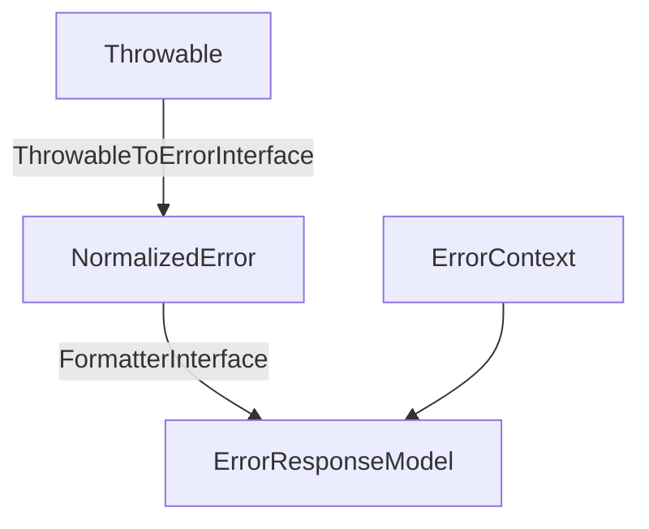

# Architecture

`maatify/exceptions` is built on a simple yet strict architecture:

## Class Hierarchy

1.  **`Throwable` (PHP Core Interface)**
    *   **`ApiAwareExceptionInterface` (Contract)** - The public contract for all application exceptions.
        *   **`MaatifyException` (Abstract Base Class)** - Implements `ApiAwareExceptionInterface` and enforces strict taxonomy rules.
            *   **Concrete Exception Families** (e.g., `SystemMaatifyException`, `ValidationMaatifyException`)
                *   **Specific Exceptions** (e.g., `DatabaseConnectionMaatifyException`, `InvalidArgumentMaatifyException`)

## Key Design Invariants

1.  **Immutability:** Exception categories are defined by the class type and cannot be changed at runtime.
2.  **Strict Taxonomy:** Only predefined `ErrorCategoryEnum` values are allowed.
3.  **Strict Typing:** All exception handling relies on PHP strict types.
4.  **Escalation Logic:** Automatic severity calculation logic resides in the base `MaatifyException` constructor.
5.  **Deterministic Serialization:** All error responses are generated through a strict, side-effect-free pipeline.

## ApiAwareExceptionInterface

The `ApiAwareExceptionInterface` defines the core contract for all exceptions:

```php
interface ApiAwareExceptionInterface extends Throwable
{
    public function getHttpStatus(): int;
    public function getErrorCode(): ErrorCodeEnum;
    public function getCategory(): ErrorCategoryEnum;
    public function isSafe(): bool;
    public function getMeta(): array;
    public function isRetryable(): bool;
}
```

*   **`isSafe()`**: Indicates if the exception message can be safely exposed to the client (e.g., Validation Errors).
*   **`isRetryable()`**: Indicates if the request can be retried immediately (e.g., Rate Limiting).

This interface guarantees that any conforming exception can be processed by a generic error handler (e.g., converting to JSON response).

---

## Serialization Layer (Phase 2)

The library includes a complete, framework-agnostic error serialization layer designed to transform any `Throwable` into a safe, deterministic HTTP response.

### The Pipeline



1.  **Normalization (`ThrowableToErrorInterface`)**:
    *   Converts an arbitrary `Throwable` into a `NormalizedError` Value Object.
    *   If the exception is `ApiAwareExceptionInterface`, it extracts precise taxonomy data.
    *   If it is a generic `Throwable` (e.g., `PDOException`), it converts it to a safe "Internal Server Error" fallback (Status 500, Category: internal).

2.  **Formatting (`FormatterInterface`)**:
    *   Takes the `NormalizedError` and `ErrorContext`.
    *   Produces an `ErrorResponseModel` (status, headers, body).
    *   **`JsonErrorFormatter`**: Produces the standard Maatify JSON envelope.
    *   **`ProblemDetailsFormatter`**: Produces an RFC7807 compliant response.

3.  **Orchestration (`ErrorSerializer`)**:
    *   Combines the Normalizer and Formatter to execute the full pipeline.
    *   Ensures determinism and type safety.
